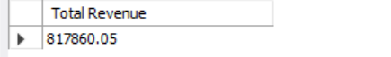
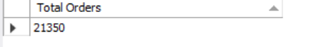
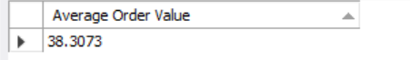
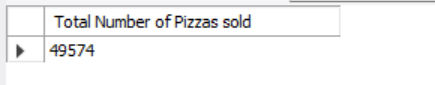
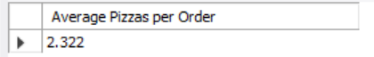
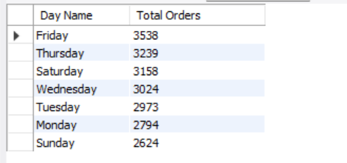
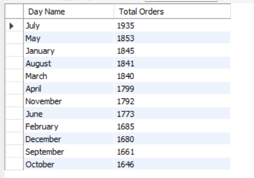
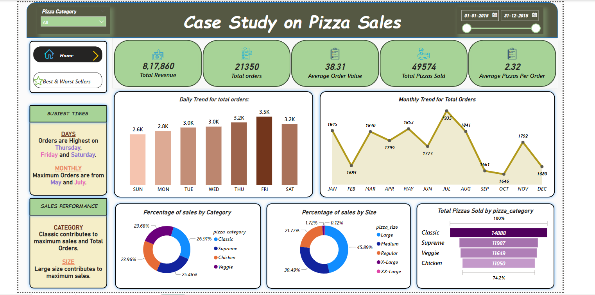
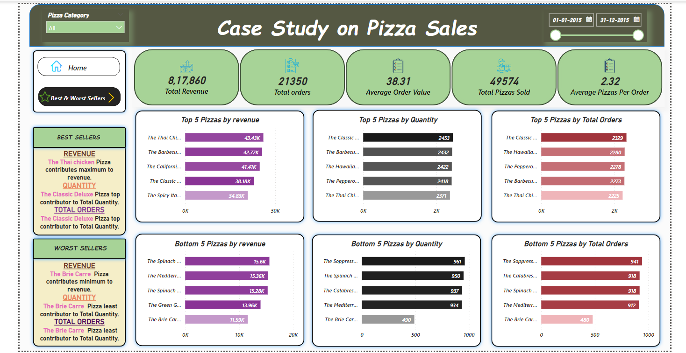

# pizza_sales

## Case Study on Pizza Sales using POWER BI and MySQL

To get a better business understanding of Pizza sales by concentrating on the _key metrics_ like monthly sales, daily sales, best sellers and worst sellers on the basis of pizza category, size and name.
## Overview

Tried to understand the trend of Pizza sales from a dataset with a size of almost 48000 values.

The dataset contains the following columns:

1. order_id:  represents the id of the order, which might contain different pizzas ordered on that order.
2. pizza_id: represents a unique id for each pizza.
3. pizza_name_id: represents the id which comprises of both pizza name and size of the pizza.
4. quantity: represents the quantity of number pizzas of similar pizza_id in the order.
5. order_date: represents the date when the order was placed.
6. order_time: represents the time when the order was played.
7. unit_price: represents the price of repective pizza.
8. total_price: total amount of the cost for the order for the given quantity and corresponding unit_price. 
9. pizza_size: gives the size of the pizza.
10. pizza_category: represents different pizza categories, which are of 4 types: classic , veggie, supreme and chiken.
11. pizza_ingredients: gives the ingredients used in the pizza.
12. pizza_name: represents the name of the pizza.

In this project , First I tried to use __MySQL__ to analyze the key metrics. Then used __Power BI__ to visually represent those key metrics and compare the results with MySQL.
## MySQL Implementation

Metrics analyzed were: 
1. Total Revenue: Sum of total price of each Order.

2. Total Orders: Number of distinct order_id will give the total orders.

3. Average Order Value: Total Revenue divided by Total orders.

4. Total Pizzas Sold: Sum of quantity of each pizza from all orders.

5. Average Pizzas per Order: Total Pizzas Sold divided by Total Orders will give Average pizzas sold.

After managing to get the key metric details, then computed the trends of the pizza sales daily/monthly and also shares of different pizzas in total revenue and total orders.

Daily Trend:

Monthly Trend:

Also computed Best and Worst selling pizzas in different categories like Pizza Revenue, Quantity ordered and Number of Orders.

Above all computations were first carried out using __MySQL__ and then used __Power BI__ to visualize them. 

## POWER BI Implementation

In POWER BI, at first transformed the data as per our requirement, like we don't have any month and day columns in the orginial dataset. So to get the daily/monthly trends quite easily, we extracted them from the  order_date column and created new columns for them.

Created two different pages for analyzing the daily/monthly trends in one and shares of different types of pizzas in the second.

Here you can find the two pages of POWER BI implementation.

Monthly and Daily trends:

Top and Bottom Selling Pizzas with different parameters:

It can seen both the implementations provide same results.
